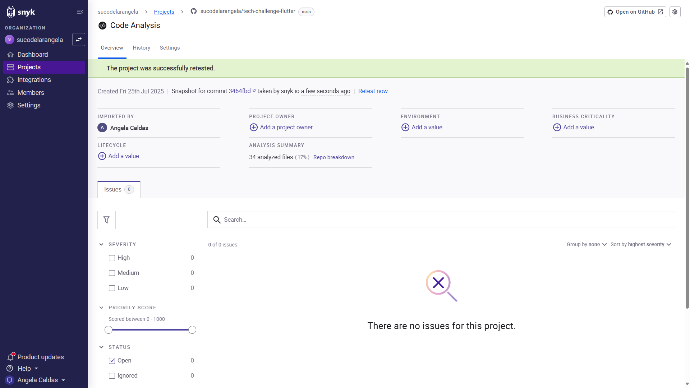

<div id="top">

# Projeto: FIAP Tech Challenge - Gestor de despesas em Flutter

</div>

<a href="#english">Read it in English</a>

## Descrição

Este projeto foi desenvolvido como parte de um Tech Challenge para a FIAP. A interface foi projetada para permitir que usuários gerenciem suas transações financeiras intuitiva e eficientemente.

O objetivo é criar uma aplicação mobile usando tecnologias à escolha(**React Native** or **Flutter**). Com foco no aprendizado, o time optou por trabalhar com **Flutter**.

## Features

- **Login**: Autenticação ou cadastro de usuários via Firebase com email e senha.
- **Home**: Mostra o saldo total e a dashboard.
- **Transações**: Mostra todas as transações com opção de ver, editar, deletar e baixar anexo (se existente). Você também pode filtrar as transações por mês ou categoria. Para editar, deletar ou baixar anexos, deslize o card da transação para a esquerda.
- **Nova/Editar Transação**: Formulário para criar ou editar transações com campos como descrição, categoria, valor, data e anexo. O formulário pode ser acessado pelo botão "+" na AppBar.

## REFATORAÇÕES PARA A FASE 4 DO TECH CHALLENGE

### Criptografia e segurança

Na autenticação, o Firebase já aplica por padrão limites automáticos para tentativas consecutivas de login com falha a partir do mesmo endereço IP ou conta de e-mail (ataques de força bruta). Além disso, implementamos o Firebase App Check, que protege os recursos do Firebase contra acessos não autorizados de clientes falsificados (bots, scripts externos).

Os bancos de dados do Firebase usados no projeto já possuem criptografia dos dados, sendo criptografia em repouso AES-256 e criptografia em trânsito com HTTPS e TLS 1.2.

Também utilizamos a plataforma [Snyk](https://app.snyk.io/) e não foram encontradas falhas de vulnerabilidade:


### Clean architecture

O projeto foi refatorado para atender um padrão de arquitetura baseado em DDD (Domain Driven Development):

- Camada de Domínio: abrange os modelos de dados e as regras de negócio;
- Camada de Infraestrutura: abrange a lógica de acessos ao banco de dados (DAO - Data Access Object);
- Camada de Aplicação: abrange os controladores, que coordenam as ações; e
- Camada de Apresentação: abrange a interface do usuário com as páginas (ou telas) e seus componentes.

## Vídeo demonstrativo

https://youtu.be/l0pXp5K4J9g

## Estrutura do projeto

```
tech_challenge_flutter/
├── android/             - Código nativo Android
├── assets/              - Imagens, fontes, favicon
├── ios/                 - Código nativo iOS
├── lib/                 - Arquivos do app
│   ├── components/      - componentes reutilizáveis
│   ├── controllers/     - Camada de interface com UI
│   ├── data/            - Camada de infraestrutura
│   │   └── dao/         - Acesso ao Firebase
│   ├── domain/          - Camada de domínio
│   │   ├── business/    - Regras de negócio
│   │   └── models/      - Modelos de dados
│   ├── screens/         - Telas principais
│   ├── utils/           - Utilidades
│   ├── widgets/         - Widgets reutilizáveis
│   └── main.dart        - Ponto de entrada
├── linux/               - Código nativo Linux
├── macos/               - Código nativo macOS
├── test/                - Arquivos de teste (não implementado)
├── web/                 - Código nativo Web
├── windows/             - Código nativo Windows
├── .gitignore
├── .metadata
├── analysis_options.yaml
├── pubspec.lock
├── pubspec.yaml
└── README.md
```

## PAcotes utilizados

```yaml
# LOCALIZAÇÃO
flutter_localizations:
  sdk: flutter
# UI
cupertino_icons: ^1.0.8
loader_overlay: ^5.0.0
flutter_slidable: ^4.0.0
flutter_native_splash: ^2.2.16
flutter_launcher_icons: ^0.10.0
# GERENCIAMENTO DE ESTADO
provider: ^6.1.5
# FIREBASE
firebase_core: ^3.13.0
firebase_storage: ^12.4.5
cloud_firestore: ^5.6.7
firebase_auth: ^5.5.3
firebase_app_check: ^0.3.2+10
# UTILIDADES
intl: ^0.19.0
uuid: ^4.5.1
path: ^1.9.1
# MÍDIA E ARMAZENAMENTO
image_picker: ^1.1.2
flutter_image_compress: ^2.1.0
image_gallery_saver_plus: ^4.0.1
# REDE E PERMISSÕES
dio: ^5.4.0
permission_handler: ^11.0.0
```

## Antes de começar

⚠️ Você **deve** ter o Android Studio já configurado com seus emuladores mobile! Se não souber como fazer isso, clique [aqui](https://developer.android.com/studio/run/managing-avds?hl=pt-br).

> Se você for um **instrutor FIAP**, você ainda terá acesso ao arquivo google-settings.json deste repositório e pode pular o próximo aviso. Após a avaliação, os banco serão finalizados e o arquivo deletado.

⚠️ Você **deve** ter um Firebase App com **Autenticação com e-mail e senha, Firestore Database e Cloud Storage** configurados para aplicativos mobile. Siga as instruções do Firebase para substituir os arquivos do app de acordo.

## Instalação e Getting Started

O projeto não está publicado em nenhuma app store e deve ser rodado localmente na sua máquina ou projetado para seu dispositivo através de uma conexão USB.

1. Clone o repositório:

```bash
git clone <REPOSITORY_URL>
cd tech_challenge_flutter
```

2. Instale as dependências:

```bash
flutter pub get
# ou abra o pubspec.yaml e salve-o
```

3. Inicie seu emulador preferido no VSCode: `ctrl + shift + p`, então selecione `Flutter: Launch Emulator` e escolha o emulador.

4. Rode a aplicação:

```bash
flutter run
# ou
flutter run <DART_FILE>
# ou use a opção Run and Debug do VSCode
```

O emulador carregará a aplicação e você poderá autenticar-se e testá-la.

## Autenticação

Use as credenciais abaixo para o login:

- **E-mail:** `teste@teste.com`
- **Senha:** `123456`

## Time

|  |  |  |
| ---------------------------------------------------------------------------- | ----------------------------------------------------------------------------- | ---------------------------------------------------------------------------- |
| [Angela Caldas](https://github.com/sucodelarangela)                          | [Guilherme Afonso](https://github.com/guilhermeafonsogauge)                   | [Paula Macedo](https://github.com/paulamacedof)                              |

<a href="#top">Voltar ao topo</a>

---

<div id="english">

# Project: FIAP Tech Challenge - Financial Manager in Flutter

</div>

## Description

This project was developed as part of the technical challenge for the FIAP Tech Challenge. The interface is designed to allow users to manage financial transactions intuitively and efficiently.

The goal is to create a mobile application for financial management using technologies of choice (**React Native** or **Flutter**). For learning reasons the team has opted to work with **Flutter**.

## Features

- **Login Page**: Allows user authentication or register via Firebase with email and password.
- **Home Page**: Displays the current account balance and dashboard.
- **Transactions Page**: Shows all transactions made, with options to view edit, delete and download attachments (if available). You may also filter transactions by month or category. To edit, delete or download the attachments, slide the transaction card to the left.
- **Add New Transaction**: Form to add or edit transactions with fields such as description, category, value, date and image attachment. The form may be accessed by touching the Add button in the appBar.

## REFACTORING FOR TECH CHALLENGE PHASE 4

### Encryption and Security

For authentication, Firebase automatically limits consecutive failed login attempts from the same IP address or email account (brute force attacks) by default. Additionally, we implemented Firebase App Check, which protects Firebase resources against unauthorized access from spoofed clients (bots, external scripts).

The Firebase databases used in the project already have data encryption, with AES-256 security encryption and encryption in transit with HTTPS and TLS 1.2.

We also used the [Snyk](https://app.snyk.io/) platform and found no vulnerabilities:


### Clean Architecture

The project was refactored to comply with an architectural standard based on DDD (Domain Driven Development):

- Domain Layer: encompasses data models and business rules;
- Infrastructure Layer: encompasses the database access logic (DAO - Data Access Object);
- Application Layer: encompasses the parameters that coordinate actions; and
- Presentation Layer: encompasses the user interface with pages (or screens) and their components.

## Project structure

```
tech_challenge_flutter/
├── android/             - Android native code
├── assets/              - Images, fonts, favicon
├── ios/                 - iOS native code
├── lib/                 - App files
│   ├── components/      - Reusable components
│   ├── controllers/     - Application layer
│   ├── data/            - Data layer
│   │   └── dao/         - Firebase connections
│   ├── domain/          - Domain layer
│   │   ├── business/    - Business rules
│   │   └── models/      - Data models
│   ├── screens/         - Main pages
│   ├── utils/           - Utilities
│   ├── widgets/         - Reusable Widgets
│   └── main.dart        - App entry point
├── linux/               - Linux native code
├── macos/               - macOS native code
├── test/                - Test files (unused)
├── web/                 - Web native code
├── windows/             - Windows native code
├── .gitignore
├── .metadata
├── analysis_options.yaml
├── pubspec.lock
├── pubspec.yaml
└── README.md
```

## Packages Used

```yaml
# LOCALIZATION
flutter_localizations:
  sdk: flutter
# UI
cupertino_icons: ^1.0.8
loader_overlay: ^5.0.0
flutter_slidable: ^4.0.0
# STATE MANAGEMENT
provider: ^6.1.5
# FIREBASE
firebase_core: ^3.13.0
firebase_storage: ^12.4.5
cloud_firestore: ^5.6.7
firebase_auth: ^5.5.3
firebase_app_check: ^0.3.2+10
# UTILITIES
intl: ^0.19.0
uuid: ^4.5.1
path: ^1.9.1
# MEDIA AND STORAGE
image_picker: ^1.1.2
flutter_image_compress: ^2.1.0
image_gallery_saver_plus: ^4.0.1
# NETWORKING AND PERMISSIONS
dio: ^5.4.0
permission_handler: ^11.0.0
```

## Before you start

⚠️ You **must** have Android Studio already configured with the mobile emulators! If you don't know how to do it, click [here](https://developer.android.com/studio/run/managing-avds?hl=pt-br).

> If you are a **FIAP instructor**, you will have access to the google-settings.json file, so you can skip the following warning

⚠️ You **must** have a Firebase App with **Authentication with e-mail and password, Firestore Database and Cloud Storage** configured for mobile apps. Follow the Firebase instructions to replace settings files accordingly.

## Installation and Getting Started

This project is not published in any mobile app store and it should be run locally on your machine or projected usb to your phone via usb connection.

1. Clone the repository:

```bash
git clone <REPOSITORY_URL>
cd tech_challenge_flutter
```

2. Install dependencies:

```bash
flutter pub get
# or enter the pubspec.yaml file and save it
```

3. Launch your preferred emulator in VSCode: `ctrl + shift + p`, then select `Flutter: Launch Emulator` and the emulator of your choice.

4. Run the development server:

```bash
flutter run
# or
flutter run <DART_FILE>
# or use your IDEs Run and Debug option
```

The emulator will open the app and you will be able to login and test it.

## Authentication

Please use the following credentials:

- **E-mail:** `teste@teste.com`
- **Password:** `123456`

## Team

|  |  |  |
| ---------------------------------------------------------------------------- | ----------------------------------------------------------------------------- | ---------------------------------------------------------------------------- |
| [Angela Caldas](https://github.com/sucodelarangela)                          | [Guilherme Afonso](https://github.com/guilhermeafonsogauge)                   | [Paula Macedo](https://github.com/paulamacedof)                              |

<a href="#top">Voltar ao topo</a>
